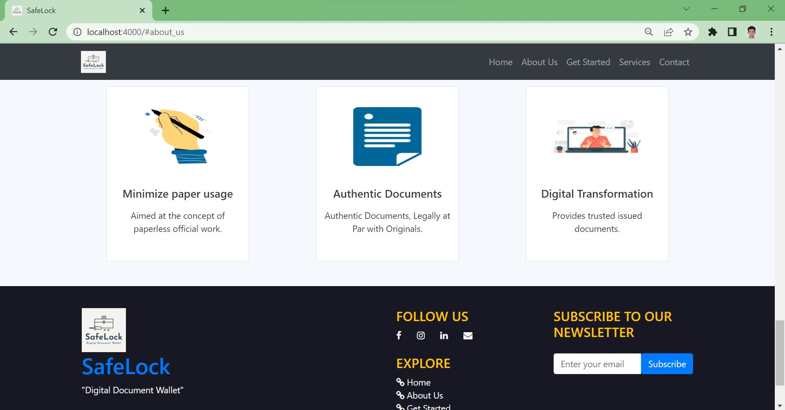

<h1 align="center">SafeLock</h1>

SafeLock is a dedicated one-stop solution for all kinds of official paperwork done, proper management in an institution .Whether you want to instantly show your credentials for your skills in an interview or just want to safely save your important documents, SafeLock will come to your rescue. But there is a catch to it. These documents will not be stored in a centralized database instead they will be stored in a decentralized manner. For this we will be using IPFS as its content addressing enables us to store large files off-chain and put immutable, permanent links in transactions — timestamping and securing content without having to put the data itself on-chain.
 

<h2 id="Screenshots">Screenshots</h2>
<h4>Home/Login page </h2>

 

<h2 id="TechnologyStack">Technology Stack</h2>

  Frontend : 
 

   
   
  
  
   

  Database : 
   
   
  File Storage : 
 
